# **Finding Lane Lines on the Road** 

## Self-driving programming assignment 1 - Writeup

---

**Finding Lane Lines on the Road**

I am going to present a way to detect the lane lines on the road by using computer vision technique and present the result of using such approach. Afterward, I will discuss the shortcomings and present possible ways to improve the detection pipeline further.

The goals/steps of this project are the following:
* Make a pipeline that finds lane lines on the road
* Report my founding in a written report

[//]: # (Image References)

[image1]: ./writeup_images/solidYellowCurve2.removecolor.png "RemoveColorNormal"
[image2]: ./writeup_images/problem.removecolor.png "RemoveColorProblem"
[image3]: ./writeup_images/solidYellowCurve2.grayscale.png "Grayscale"
[image4]: ./writeup_images/solidYellowCurve2.guassian.png "Guassian"
[image5]: ./writeup_images/solidYellowCurve2.canny.png "Canny"
[image6]: ./writeup_images/solidYellowCurve2.masked.png "Masked"
[image7]: ./writeup_images/problem.masked.png "MaskedProblem"
[image8]: ./writeup_images/solidYellowCurve2.houghline.png "HoughLine"
[image9]: ./writeup_images/solidYellowCurve2.houghline.png "HoughLineProblem"
[image10]: ./test_images_output/solidWhiteCurve.jpg "Solid white curve lane"
[image11]: ./test_images_output/solidWhiteRight.jpg "Solid White right lane"
[image12]: ./test_images_output/solidYellowCurve.jpg "Solid Yello curve lane"
[image13]: ./test_images_output/solidYellowCurve2.jpg "Solid Yellow curve lane 2"
[image14]: ./test_images_output/solidYellowLeft.jpg "Solid Yello left lane"
[image15]: ./test_images_output/whiteCarLaneSwitch.jpg "White car lane switch"

---

### Reflection

### 1. Lane detection pipeline overview

The lane detection pipeline contains the followings steps:

1. Remove unwanted object using color
2. Convert the image to grayscale
3. Use Gaussian blur to blur the image
4. Use Canny algorithm to detect edges
5. Remove unwanted edges using a mask, so that the image only showing edges on the road.
6. From the masked edge image, Use Hough Line algorithm to find lines
7. We remove any invalid lines in step 6 and label the remaining line into left and right lane.
8. Find out the left and right lane by averaging the lines within label
9. If this is a video, the lane lines are added to the detected lane lines in the previous frame using the exponential moving average.

In the following, I am going to present the above step one by one.

#### 1.1  Remove unwanted object using color
The colors of lane lines in our experience are either yellow or white, so we are going to remove part of the image which is not in yellow or white, here is the resulting image.

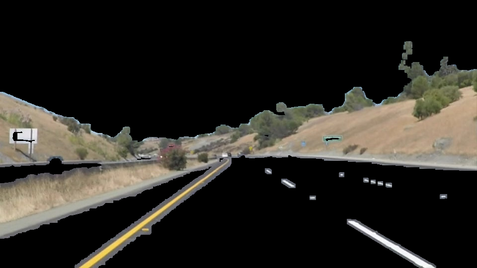

In the above image, you can see that only the lane lines are preserved, while most of the road surface is removed, and so as the roadsides.

Most of the time, this step can remove most of the part of the image, but there are cases, for example, the color of the surface of the road is close to white or yellow, in this case, this step cannot remove the surface of the road. Here is the example.

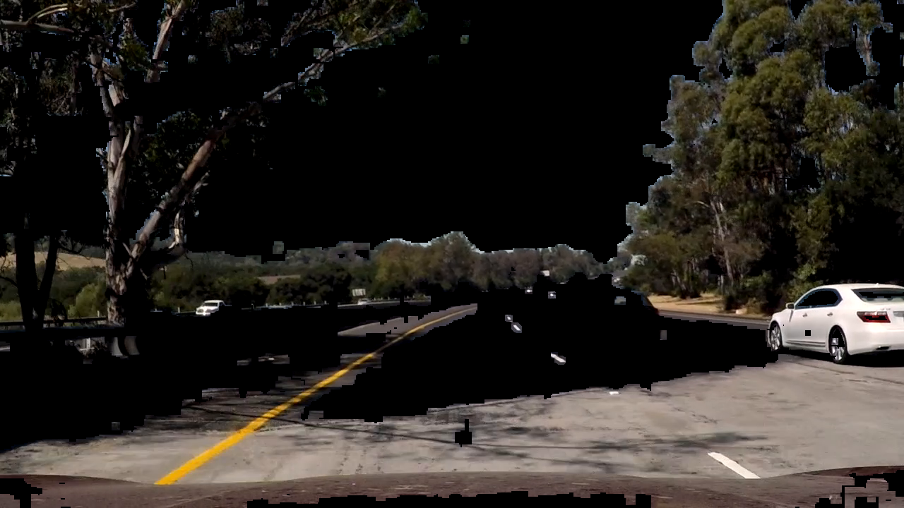

#### 1.2 Convert the image to grayscale
This step is for the later steps, which Canny algorithm and Hough algorithm depends on a gray-scale image

#### 1.3  Use Gaussian blur to blur the image
This step is to remove any unwanted detail and hence the Canny algorithm does not catch fine details on the image, for example, the texture of the road.

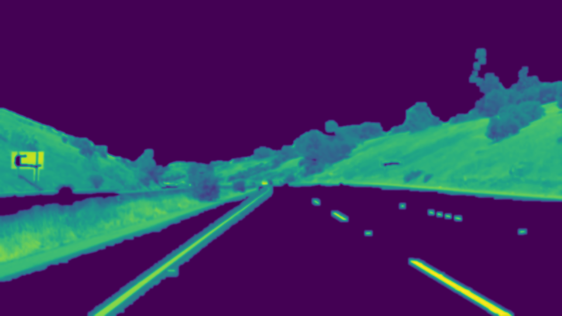

#### 1.4  Use Canny algorithm to detect edges
This step is to convert a gray-scale image to an image with edges highlighted. This step extracts edges which will be processed to become the left and right lane.

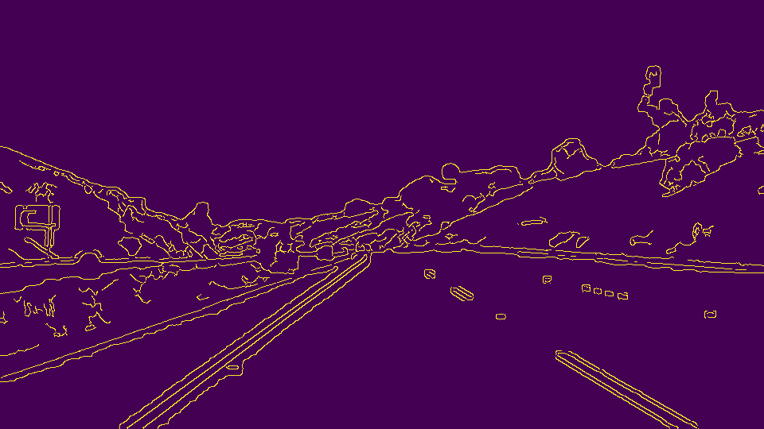

It requires a low and high threshold, but it is not going to be constant throughout the video context. Failure in detecting edges results in missing lane lines, so an adaptive algorithm is used to enhance the performance of this step.

#### 1.5 Remove unwanted edges using a mask
The image still contains unwanted details, especially on the road-side, running Hough Line algorithm without masking is not going to work its best because of the noise.

We define the possible lane area as a trapezium, after the masking is done, we can see the image is much simpler

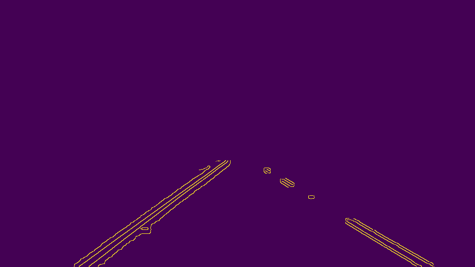

Unfortunately, road surface can have texture/shadow which Gaussian blur in step 3 cannot remove.

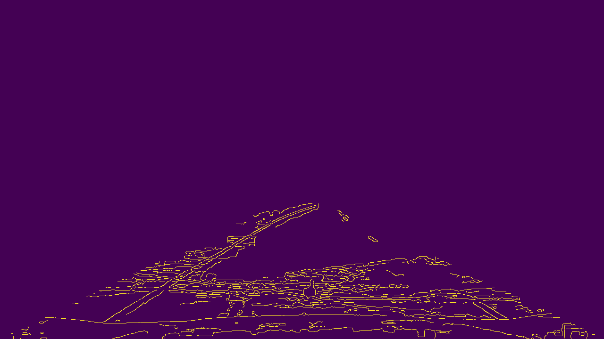

#### 1.6  Use Hough Line algorithm to find line segments
To this stage, most of the image details are purged, and only lane lines and some noise remain. In this step, Hough line algorithm is used to extract line segments, in Two-point form (x1, y1, x2, y2)

#### 1.7  Remove unwanted and grouping of line segments
From observation, lane lines are unlikely to be a horizontal line if the car is moving at the center of the lane. so we are going to remove line segments which are closed to horizontal. 

Also from observation, the lane is likely to be in constant width, so if the car is driving in the middle of the lane, we can conclude:

1. If this is a right lane, it will be on the right and have a positive slope
2. If this is a left lane, it will be on the left and have a negative slope

By considering this, we label lines segment to be a left lane line or a right lane line or a random line.

#### 1.8  Find out the left and right lane lines in the image
We use the median of slope and y-intercept of the line segments labeled as lane lines to determine the final lane lines.

Here is the normal case

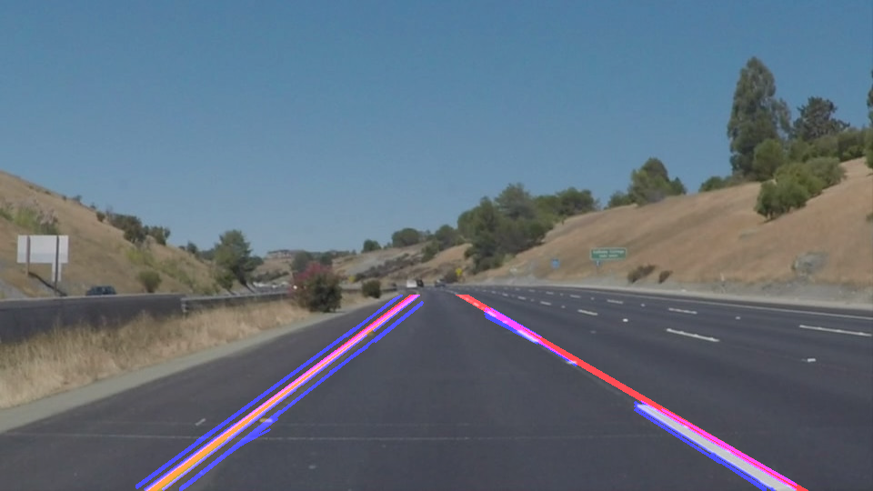

and here is a challenging case, you can see 

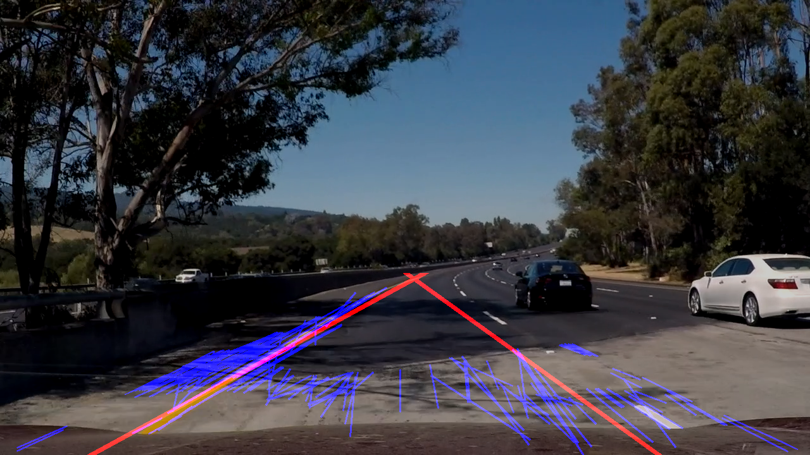

### 1.9 Determine the final lane lines
In the video, sometimes, a frame hits a boundary case which makes those lane lines detected deviate from the correct answer. Because this is a video, we can use the result of the previous frames to correct the lane line. 
The decay rate of the exponential moving average depends on the speed of the car. Slower the car is, smaller the decay rate.

### 2. Result

The proposed pipeline is used to annotated 6 pictures and 3 video clips, here is the result.

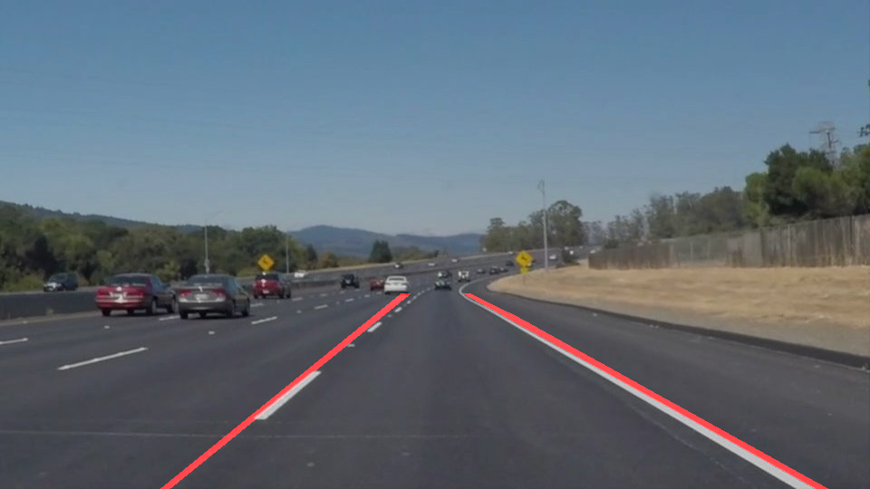

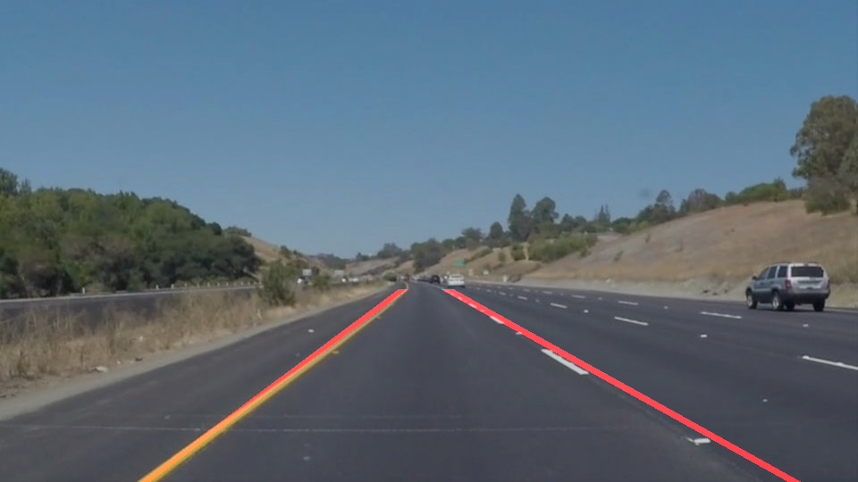
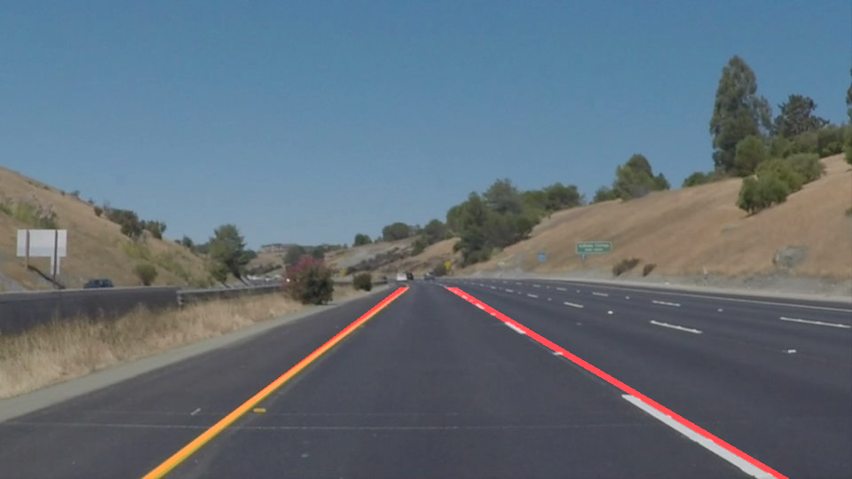
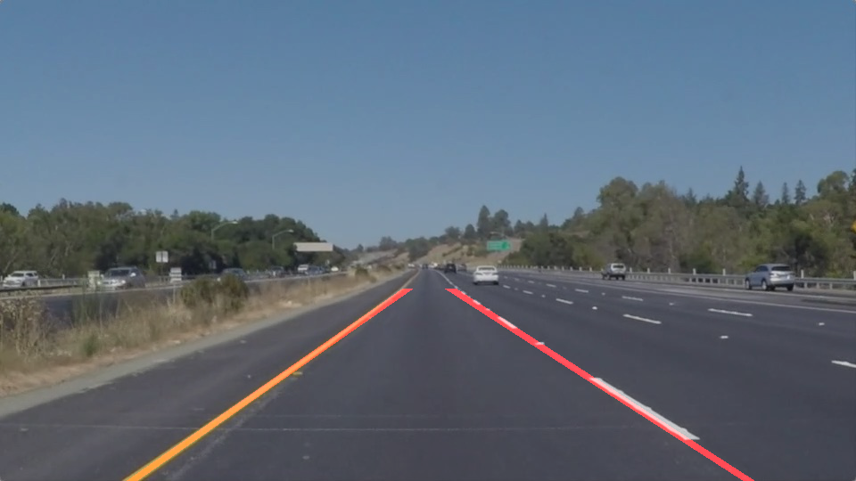
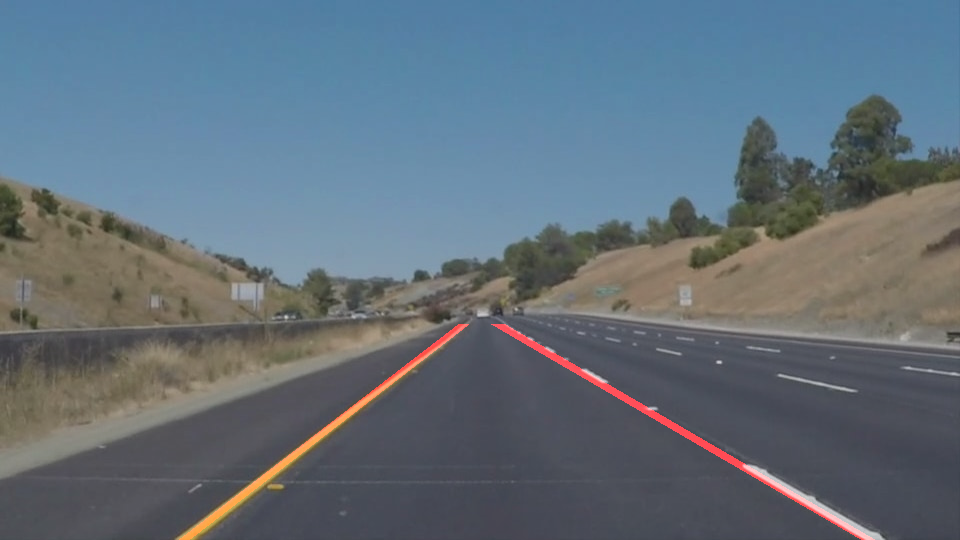

The result looks promising in normal cases.

When processing challenge.mp4, we saw the computed lane lines move forward and backward when the road surface becomes more complex. This is because the Hough algorithm return line segments which capture the texture on the road surface.

### 3. Potential shortcomings with the current pipeline
In this section, I am going to discuss the potential shortcoming of the current pipeline.

    1. Texture or signal on the surface of the road
	
    2. The assumption made on the lane road and the car position in the lane.
	
    3. Removal of horizontal line on the road

#### 3.1 Texture, shadow or signal on the surface of the road
Although using a mask and remove image component by color remove most of the irrelevant detail from the picture, sometimes noises still in the picture and affect the accuracy of Hough Line algorithm and hence the final position of the lane lines. Like the following example.

#### 3.2 Assumption made on the lane road and the car position in the lane
In this project, I present the result by using video tapping the car driving through a straight lane, but in reality, they may not.

For example, in a left curve road, the left and right lane line only abide by our assumption for a very short distance. and then a left lane line has a positive slope.

Although this is the case, I argue that even if the slope requirement is lessened for left and right lane line does not provide any usefulness (assuming the Hough Line algorithm return only the line segments related to lane lines), for example, roundabout and a sharp turning corner.

#### 3.3 Removal of horizontal line on the road lane surface
In the filtering step, the pipeline removes horizontal lines detected on the road surface. They are most likely the texture of the road or shadow in the test video. But removing this information may make signals marked on lane line unreadable when it is used in real cases.

In most case, the horizontal lines are on the lane surface near the car, which Canny algorithm provide enough edge for Hough algorithm to create random lines.

How about removing the road surface in front of the car? Doing this result in a much smaller detection area, and when the car is not centered, both of the lane lines can be masked, and hence cannot be detected, so I don't recommend this approach as it depends on the car position on the lane.

### 4. Suggest possible improvements to the proposed pipeline

1. Improving runtime of the lane detection algorithm. The pipeline made use of median instead of average to find the slope and y-intercept for both lane lines. It is because slope goes near to infinity when a line is nearly vertical and by averaging makes the result close to infinity and hence a vertical line is returned as a lane line which is incorrect.

I also want to have more weighting if the line is long, result in finding the median in a big number list.

2. Adaptive masking to find lane if the car is not in the center of the lane. In this project, we only use video where the car is driving in the center of the lane, hence I don't need to worry about if I accidentally mask away the lane line. This should not be the case in the real situation.

3. Driving in different weather condition and at night. In this project, I have only considered driving on a sunny day. In future, the pipeline will be tested in different weather condition and further improved.
